

# 🛰️ Radiant Archive Tools

**Blender ⇄ Radiant live link and terrain sculpting for Call of Duty: Black Ops III**

A plugin for Radiant, made for MTPlugins, plus a Blender add-on that links Blender to Radiant.

---

## ✨ Features

### 🔗 Blender Live Link
Build in Blender and see it in Radiant, select in Radiant and see it in Blender.

- Brushes made in Blender appear in Radiant.
- Brushes selected in Radiant appear in Blender.
- Compatible with the Team Create plugin.

### 🖌️ Terrain Brushes
Blender's sculpt brushes on Radiant terrain patches, with Blender's own icons and a hover tag on each. Radius, strength, falloff and brush feel are all adjustable.

**Brushes**

<table>
<tr>
<td align="center">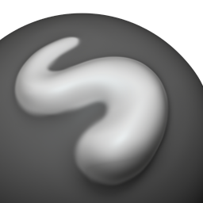 Draw</td>
<td align="center">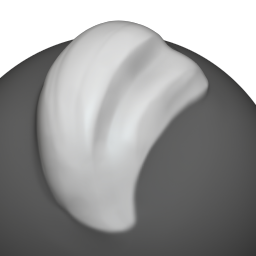 Clay</td>
<td align="center">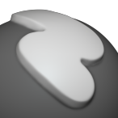 Layer</td>
<td align="center">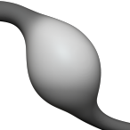 Inflate</td>
<td align="center">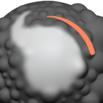 Smooth</td>
<td align="center">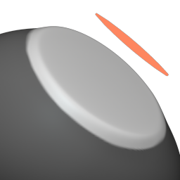 Flatten</td>
<td align="center">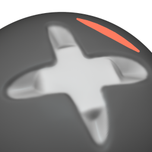 Fill</td>
</tr>
<tr>
<td align="center">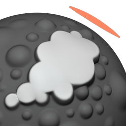 Scrape</td>
<td align="center">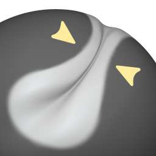 Pinch</td>
<td align="center">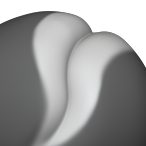 Crease</td>
<td align="center">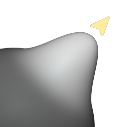 Grab</td>
<td align="center">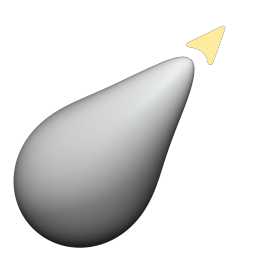 Elastic Deform</td>
<td align="center">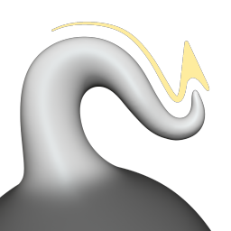 Snake Hook</td>
<td align="center">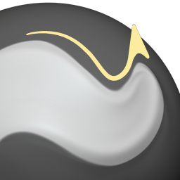 Nudge</td>
</tr>
</table>

**Experimental**

<table>
<tr>
<td align="center">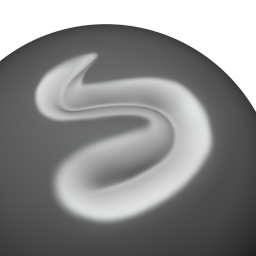 Draw Sharp</td>
<td align="center">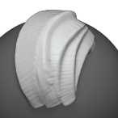 Clay Strips</td>
<td align="center">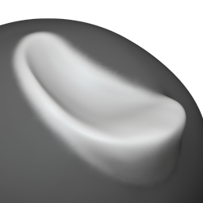 Clay Thumb</td>
<td align="center">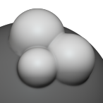 Blob</td>
<td align="center">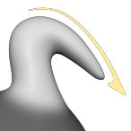 Pull</td>
<td align="center">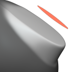 Plateau</td>
<td align="center">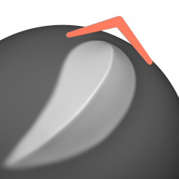 Multi-plane Scrape</td>
</tr>
<tr>
<td align="center">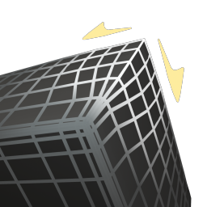 Relax Slide</td>
<td align="center"> Relax Pinch</td>
<td align="center">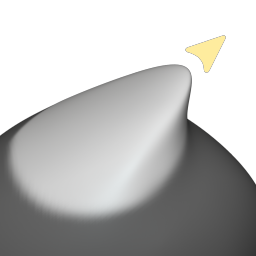 Thumb</td>
<td align="center"> Twist</td>
<td align="center">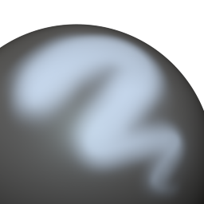 Airbrush</td>
<td align="center">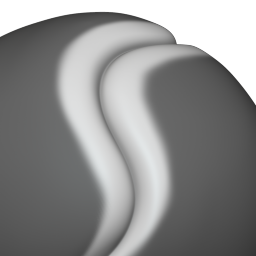 Crease Sharp</td>
<td align="center">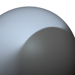 Sharpen</td>
</tr>
</table>

### 🧰 Terrain Tools
- **Sculpt mode:** select terrain patches and sculpt them in the 3D view.
- **Drag makes a patch:** drag in the top view to make a terrain patch instead of a brush.

### 🗺️ Planned
- 🎨 **Terrain Presets:** ready-made terrain setups.
- ⚡ **Terrain Optimization:** tools to keep terrain patches light.

## 📋 Requirements
- 🎮 Call of Duty: Black Ops III Mod Tools with MTPlugins
- 🟠 Blender 4.2 or newer

## 📦 Install

### Plugin
1. Copy `RadiantArchive.dll` into `<BO3>\bin\plugins\RadiantArchive\`, and the `assets\brushes` folder into `<BO3>\bin\plugins\RadiantArchive\assets\brushes\`.
2. In Radiant, press **Ctrl+Shift+P** and tick **Radiant Archive**.

### Blender add-on
1. **Edit > Preferences > Add-ons > Install from Disk**, pick `dist\radiant_blender_link.zip` and enable it.
2. Open the 3D view sidebar (**N**), go to the **Radiant** tab and press **Connect**.

## 🙏 Credits
Brush icons are Blender's artwork (GPL). Built on MTPlugins (GPL-3.0).

## 📄 License
GPL-3.0
